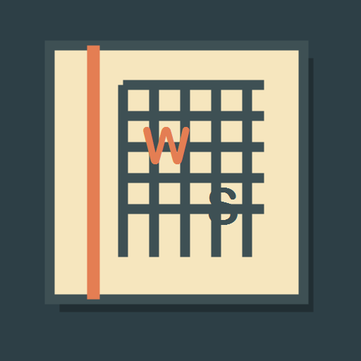
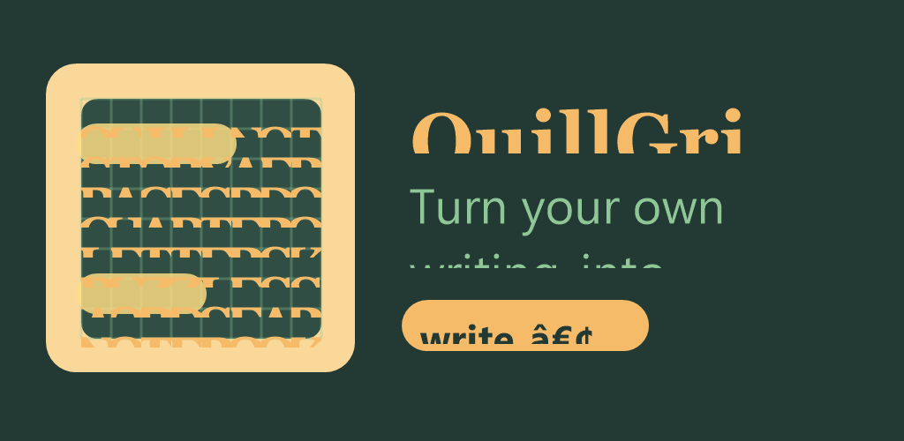
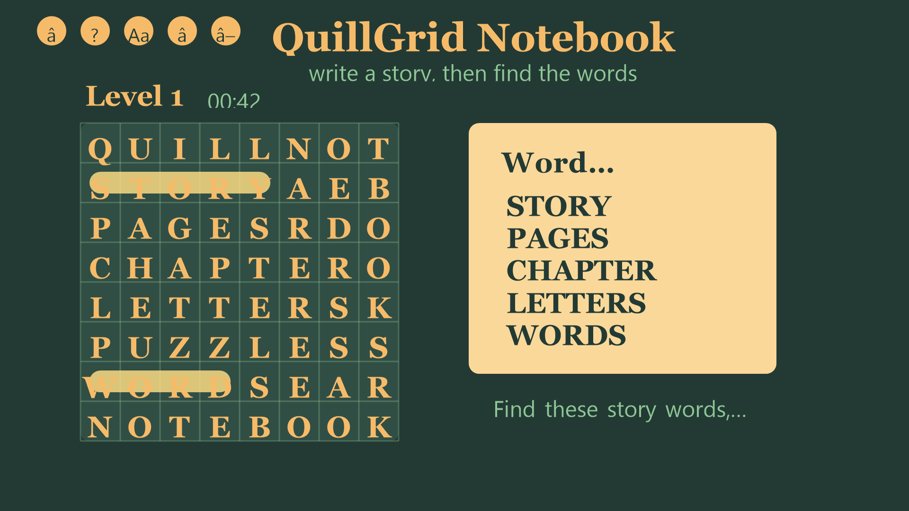
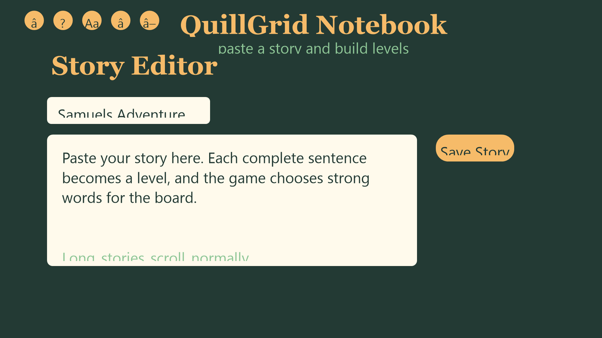
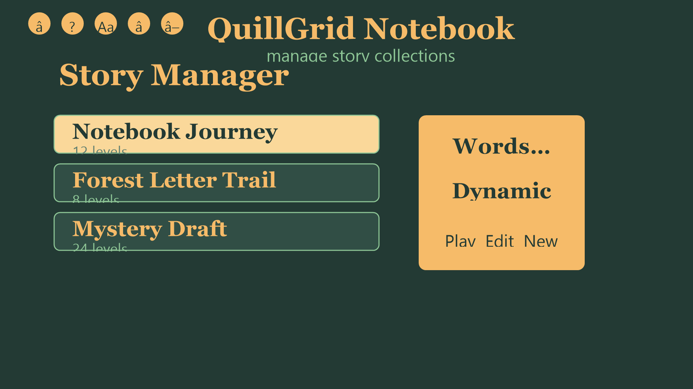
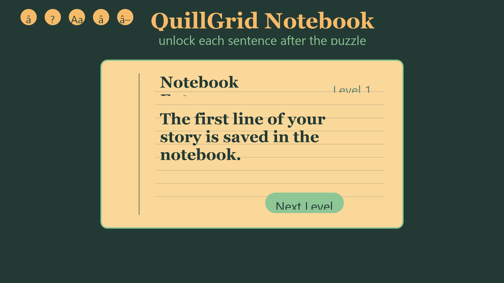

# QuillGrid Notebook

Status: Android game submitted to Google Play production review

QuillGrid Notebook is a small Android word-search game built around story-generated letter-grid levels. Players write or paste a story, turn sentences into playable puzzle chapters, and unlock the notebook one completed level at a time.

This repository is kept as a public project exhibit rather than a full source-code release. It documents the app concept, release preparation, store materials, and privacy policy while keeping the active Godot project and signing/build workflow local.

## What It Demonstrates

- Built a Godot 4 Android game with a custom 2D puzzle interface.
- Implemented story-to-level generation for letter-grid gameplay.
- Prepared an Android App Bundle for Google Play.
- Created store listing copy, screenshots, app icon, feature graphic, and privacy policy.
- Completed Play Console app-content declarations and submitted the first production release for review.
- Kept the public repository legally distinct from any reference material or extracted assets.

## Gameplay

Players find selected words from each sentence on a letter grid. Solving a level reveals the sentence, gradually building a readable notebook from the player's own writing.

Core features:

- Story editor for pasted or original text.
- Story manager for local story collections.
- Generated puzzle chapters from sentence text.
- Drag-based word selection.
- Completion screen that reveals the solved sentence.
- Local-only progress and settings.
- No account, ads, analytics, cloud sync, or server upload.

## Release Status

- App name: `QuillGrid Notebook`
- Package name: `com.carterhowell.quillgridnotebook`
- Platform: Android
- Engine: Godot 4
- Price: Free
- First production release: `1 (1.0.0)`
- Google Play status: production release submitted; changes are in review

The public Play Store listing may not be visible until Google review and publishing propagation finish.

## Public Pages

- Project page: https://carter-howell.github.io/quillgrid-notebook/
- Privacy policy: https://carter-howell.github.io/quillgrid-notebook/privacy-policy.html

The privacy policy is kept in `docs/privacy-policy.html` because that URL is used for the Google Play listing.

## Media

Store-ready visual assets are kept under `media/`.

### App Icon

### Feature Graphic

### Screenshots

## Source Availability

The active Godot source is intentionally not published in this repository. The public repo is an exhibit and release record, not an installable development checkout.

This keeps the GitHub page focused on the finished project, avoids exposing local publishing credentials or build artifacts, and lets the game code continue to evolve privately while the app is reviewed on Google Play.

## Portfolio Note

This is a supporting software/game project. It demonstrates product completion, Android publishing, local-data privacy, and polished release preparation, but it should sit below embedded systems, PCB design, robotics, and power-electronics work in an electrical-engineering-focused portfolio.
